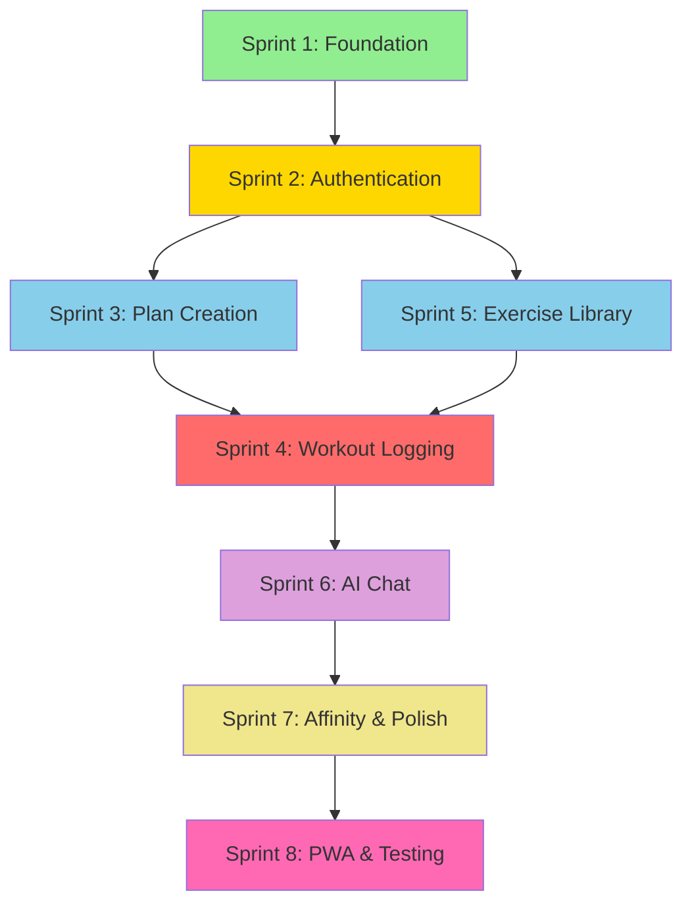

# Dependencies Map - Slow Burn Frontend

## Critical Path Analysis



## Sprint 2: Authentication Dependencies

### Upstream Dependencies (Must be completed first)
1. **Project Setup (Sprint 1)** ✅
   - React + TypeScript environment
   - Routing infrastructure
   - Component library (shadcn/ui)
   - State management setup

2. **Backend API Endpoints**
   - `/api/auth/signup` - User registration
   - `/api/auth/login` - User authentication
   - `/api/auth/logout` - Session termination
   - `/api/auth/refresh` - Token refresh
   - `/api/auth/user` - Current user info

3. **Supabase Configuration**
   - Auth schema in database
   - JWT secret configuration
   - Email templates (handled by backend)

### Downstream Dependencies (Blocked by Authentication)
1. **All User-Specific Features**
   - Workout plan creation (Sprint 3)
   - Workout logging (Sprint 4)
   - Progress tracking
   - AI chat personalization (Sprint 6)

2. **Data Persistence**
   - User preferences
   - Workout history
   - Custom exercises
   - Affinity scores

## Technical Dependency Graph

### Component Dependencies
```
App.tsx
├── Router
│   ├── PublicRoutes
│   │   ├── LoginPage → LoginForm → AuthService
│   │   ├── SignupPage → SignupForm → AuthService
│   │   └── ForgotPasswordPage → ForgotPasswordForm → AuthService
│   └── ProtectedRoutes → AuthStore
│       ├── DashboardPage
│       ├── WorkoutPages
│       └── ProfilePages
├── AuthProvider → AuthStore
└── ThemeProvider
```

### Service Layer Dependencies
```
AuthService
├── API Client (axios instance)
├── Token Manager
│   ├── localStorage (persistence)
│   └── Token Refresh Logic
└── Error Handler

AuthStore (Zustand)
├── AuthService
├── User State
├── Session State
└── Persistence Middleware
```

## Risk Mitigation Strategies

### 1. Backend API Not Ready
**Mitigation:** Implement mock service layer
```typescript
interface AuthService {
  login(credentials: LoginCredentials): Promise<AuthResponse>;
  signup(data: SignupData): Promise<AuthResponse>;
  // ... other methods
}

// Can swap between MockAuthService and RealAuthService
const authService: AuthService = process.env.USE_MOCK 
  ? new MockAuthService() 
  : new RealAuthService();
```

### 2. Token Management Complexity
**Mitigation:** Progressive enhancement approach
1. **Phase 1:** Basic token storage and manual refresh
2. **Phase 2:** Automatic refresh on 401 responses
3. **Phase 3:** Proactive refresh before expiration

### 3. Route Protection Edge Cases
**Mitigation:** Comprehensive testing matrix
- User logs in → can access protected routes ✓
- User logs out → redirected to login ✓
- Token expires → automatic refresh attempted ✓
- Refresh fails → redirected to login ✓
- Direct URL access → proper redirect ✓

## Integration Points

### With Backend (FastAPI)
- **Authentication Flow:** REST API over HTTPS
- **Token Format:** JWT with refresh token
- **Error Codes:** Standardized HTTP status codes
- **CORS:** Configured for Vercel deployment

### With Supabase
- **Through Backend:** Frontend never directly touches Supabase
- **User Data:** Stored in Supabase, accessed via backend
- **Real-time:** Not used in MVP (future enhancement)

### With PWA Features
- **Offline Handling:** Auth state persisted locally
- **Service Worker:** Excludes auth endpoints from cache
- **Background Sync:** Queued auth requests when offline

## Testing Dependencies

### Unit Testing Requirements
- Mock auth service for component tests
- Mock Zustand store for hook tests
- Mock router for navigation tests

### Integration Testing Requirements
- Test database with known users
- Backend API running locally
- Network condition simulation

## Performance Considerations

### Bundle Size Impact
- Zod: ~15KB (for validation)
- Axios: ~20KB (for API calls)
- Zustand: ~10KB (for state management)
- **Total Auth Bundle:** ~45KB + components

### Load Time Optimization
1. Lazy load auth components
2. Preload critical auth routes
3. Cache auth assets in service worker

---

*Last Updated: 2025-01-27*